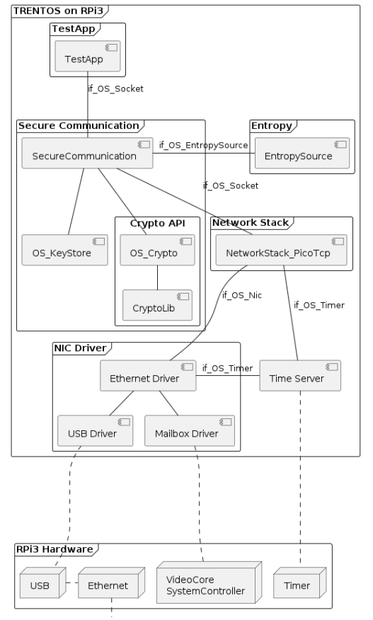
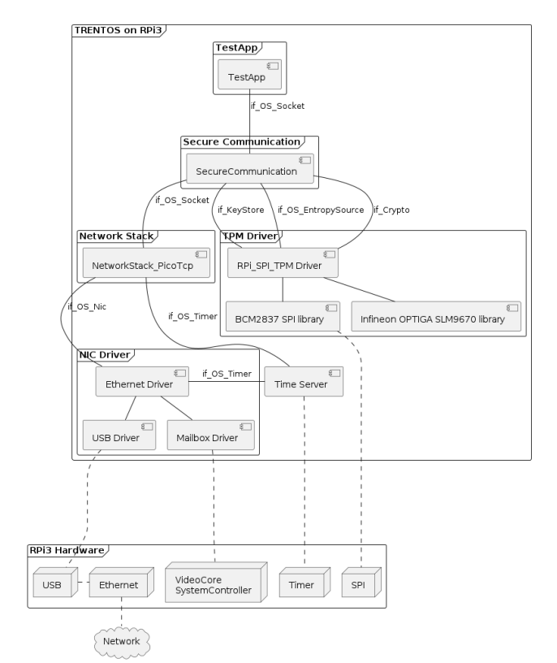
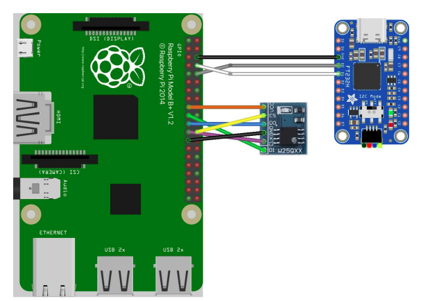

# Secure communication with TPM

This document describes the project ws2022_team_4_tpm which implements a Secure Communication component and TPM support.

With this component it is possible to connect with a socket interface to other devices and communicate over an encrypted connection.

For testing purposes a TestApp component is also present.

Overview of software based implementation:



Overview of tpm based implementation:



## Built With

* [TRENTOS SDK][trentos-url]
* [SeL4 microkernel][sel4-url]
* [wolfTPM][wolfTPM-url]
* [wolfSSL][wolfSSL-url]
* [mbedtls][mbedtls-url]

## Compilation

The project folder has to be placed into the TRENTOS SDK at

`./sdk/demos/ws2022_team_4_tpm`

Several patches have to be added to the TRENTOS SDK with `patch -p1 < {PATCH}.diff`

- [Patch KeyStoreRamFV](https://www.moodle.tum.de/pluginfile.php/3784730/mod_forum/attachment/756376/0001-Add-os_keystore_common-library-to-os_keystore_ram_fv.patch)
- [Patch RSA 1](https://zulip.in.tum.de/user_uploads/2/68/fTsA25gb7L-YSVEf3oUSn--5/sdk_add_rsa.diff)
- [Patch RSA 2](https://zulip.in.tum.de/user_uploads/2/39/k32o0WO8veeznVABzzRFXQed/sdk_add_rsa_update.patch)

Adjust the default value of key sizes in OS_Keystore:

- `../libs/os_keystore/os_keystore_ram_fv/include/OS_KeystoreRamFV.h`: change the value of `OS_KeystoreRamFV_MAX_KEY_SIZE` in line 36 from `2048` to `2080`
- `../libs/os_keystore/os_keystore_ram_fv/keystore_ram_fv/KeystoreRamFV.h`: change the value of `KeystoreRamFV_KEY_DATA_SIZE` in line 12 from `2052` to `2084`

(Optional) For a more clear debug log, comment out the `ZF_lOGE` macros at:

`./sdk/sdk-sel4-camkes/libs/sel4_util_libs/libplatsupport/src/plat/bcm2837/system_timer.c`

### Build the project with the following command:

```
bash sdk/scripts/open_trentos_build_env.sh sdk/build-system.sh sdk/demos/ws2022_team_4_tpm rpi3 build-rpi3-Debug-demo_tpm -DCMAKE_BUILD_TYPE=Debug -DHW_TPM=ON
```

`-DHW_TPM=ON` adds hardware support for the TPM. To run the component without it use `-DHW_TPM=OFF`.

### Compilation Flags

Add flags with `-D{FLAG}={VALUE}` to toggle functionality.

| Flag | Values | Default Value | Description |
|------|--------|---------------|-------------|
| HW_TPM | ON, OFF | OFF | Toggles hardware support for the SLB9670 TPM |
| CLEAR_TPM | ON, OFF | OFF | Clears TPM on boot |
| WOLF_DEBUG | ON, OFF | OFF | Toggles wolfTPM and wolfSSL debug info |
| BENCHMARK | ON, OFF | OFF | Toggles rudimentary benchmark of encrypt, decrypt and keygen functionality |

Note: The filesystem functionality is not supported if HW_TPM=ON is used.

## Hardware Setup

This project is tailored to the RaspberryPi 3b+ platform. For more information and a detailed setup on the RPI3 see the TRENTOS Handbook V1.3 on page 256.

Connect the UART Controller to the RPi according to the following picture and connect it with your developement machine. Connect the RPi and your developement machine via ethernet. Connect the TPM module according to the picture.



Configure the network interface for the wired connection between the RPi and your developement machine (e.g. with `ip addr add` or NetworkManager) to be assigned with the ip address `10.0.0.10`.

Format an sd card with a FAT filesystem and copy all files from the folder `./sdk/resources/rpi3_sd_card` onto the sd card. After compilation copy the image `../build-rpi3-Debug-demo_tpm/images/os_image.elf` onto the sd card. Ensure files are written to sd card.

In the file `config.txt` in the boot partition of the RPi add the line `enable_jtag_gpio=0`.

Insert the sd card into the RPI.

## Test

Launch the UART interface with the following command:

```
sudo picocom -b 115200 /dev/<ttyUSBX>
```

Hereby, acts as a placeholder for the specific device representing the USB-to-UART adapter, e.g. ttyUSB0.

Launch the test server `./sdk/demos/ws2022_team_4_tpm/Project Assignments - Resources-20221220/srv.py` (Note: If the test server is not able to listen on the wired connection, you may have to power on the RPI first before starting the test server)

Power on the RPI.

### Key loading and generation with `-DHW_TPM=ON`

If no client key is found in TPM_Keystore, the program will try to import one from `system_config.h`. If `CLIENT_PRIVATE_KEY` in system_config.h is set to an invalid value it will generate a new key. In any case the new key will be saved to the keystore for future reboots. On each boot cycle the client public client key will be printed to the debug console.

The server public key is not stored in the TPM_Keystore. This would require a different `if_Keystore` implementation, since wolfTPM does not support storing only the public key without it's private counter-part with `wolfTPM2_NVStoreKey()`. In my opinion the use-case doesn't justify a different implementation since the public key is configured on the server and is by definition not a secret, so I decided against implementing one. For that reason, the server public key will always be imported from the `SERVER_PUBLIC_KEY` constant defined in `system_config.h`.

The `CLIENT_PUBLIC_KEY` constant will not be used in TPM mode, since the client public key will be generated from it's private counterpart.

The TPM can be cleared on boot with the `-DCLEAR_TPM=ON` build flag. This will clear the entire TPM, not just the keystore. Use with care!

## Implementation Details

### Custom Interfaces

The TPM component provides two custom interfaces:
  - if_Crypto
  - if_Keystore

For convenience two wrapper libraries are provided:
  - TPM_Crypto
  - TPM_Keystore

The interface and libraries are declared in `components/RPi_SPI_TPM/interfaces`. See the library header files for implementation details.

## Demo Video


In this demo `HW_TPM=ON` is used and a TPM is used which already has created a root key and has a client key stored. The server key is imported from the `system_config.h` file.

Target in demo was build with:

```
bash sdk/scripts/open_trentos_build_env.sh sdk/build-system.sh sdk/demos/ws2022_team_4_tpm rpi3 build-rpi3-Debug-demo_tpm -DCMAKE_BUILD_TYPE=Debug -DHW_TPM=ON
```

## Presentation Slides

[Vortrag_TRENTOS.pdf](doc/uploads/1ad2292874c114dafadfe4a2e06a90fd/Vortrag_TRENTOS.pdf)

[trentos-url]: https://www.trentos.de/
[sel4-url]:    https://www.trentos.de/
[wolfTPM-url]: https://github.com/wolfSSL/wolfTPM
[wolfSSL-url]: https://github.com/wolfSSL/wolfSSL
[mbedtls-url]: https://github.com/Mbed-TLS/mbedtls
